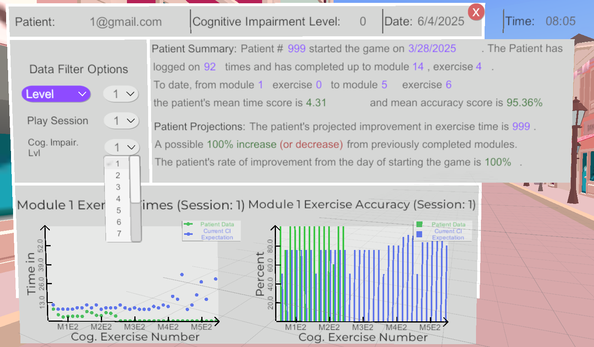

# Terminology

- **Level**: World player is in, contains one or more modules.
- **Module**: Floating numbers that act as save points. Contains one or greater exercises.
- **Exercise**: Individual task within each numbered module, "games user plays". Also includes walking to modules.
- **Patient Data**: The player's performance data. More information in the next section.
- **CI Data**: Serves as a baseline for determining how a patient should perform for each exercise. More information in the next section.

# Patient Data

The player’s performance is saved in a file named `patient_data.csv` using the `SavePatientData.cs` script. The local data is stored at `C:\<your user>\AppData\LocalLow\University of Kentucky\Homebound\patient_data.csv`. Upon starting a new game, every row in the Patient Data file is filled out with placeholder `0` values. Upon completion of an exercise, the player’s performance is saved.

Each row in the file contains these values:
- **Exercise**: Unique exercise number. Increases starting from 0 to the final exercise.
- **Time**: The total duration taken to complete the exercise.
- **Successes**: The total number of correct answers picked. Once all correct answers have been selected the user advances to the new exercise or module. This number varies per exercise.
- **Misses**: The total number of incorrect answers picked.

Excercises that track the user navigating to the next module are also included in the Patient Data (will call them "WalkTo" exercise from here on out). The "WalkTo" exercise falls at the start of a module. For example, say Level 1 Module 1 has six exercises. Before these six exercise entries in our Patient Data file there will be an entry for the "WalkTo" exercise.

The number next to each `Time`, `Successes`, and `Misses` column indicate the attempt. So `Time 1`, `Success 1` and `Misses 1` all correspond to the first attempt, `Time 2`, `Success 2` and `Misses 2` to attempt 2 and so on. At time of writing, this allows players to save up to 3 attempts through the game. The first 2 will always be the patients’ first 2 attempts, but every attempt after that is considered attempt 3.

# New Game vs Continue

Upon the user clicking *New Game* from the Main Menu, a new set of rows will be created for all the exercises and appended after the rows from the last game. If the user clicks *Continue* the user will be taken to the last module they left off at. If any exercises are repeated, the current attempt will jump. For example, if rows `Time 1`, `Success 1` and `Misses 1` for exercise 7 are filled out and the user completes exercise 7 again, the new data will be recorded in columns `Time 2`, `Success 2` and `Misses 2`.

# CI Data

As stated above, the CI data serves as a baseline for determining how a patient should perform for each exercise. Currently, all expectations for all CI levels are based on Michael Probst's performance of the game where the CI level 0 are Michael Probst's exact scores with a bit of a buffer to make it a bit easier. After altering the `Assets/ScriptableObjects/InitialCIData.asset` the local data .csv files located at `C:\<your user>\AppData\LocalLow\University of Kentucky\Homebound\ci_data.csv` must be deleted. If you don’t, your changes will not be made. Note that you only need to input the CI requirements for CI level 0 for each exercise, all other CI levels have their criteria automatically generated upon creation of the `ci_data.csv` file.

The format of the CI Data is similar to the Patient Data but differs in its use. The `Exercise` column is again used as an identifier for the exercise. `Time 1`, `Successes 1` and `Misses 1` represent the baseline data for cognitive level 1. The next group, `Time 2`, `Successes 2` and `Misses 2`, represents the baseline data for cognitive level 2. The columns go on until we reach cognitive level 15.

# Scoring and Statistics

Module score is determined by how many cognitive impairment (CI) levels off the player is performing. For example, if a player performs at a CI level of 4, but is diagnosed at a CI of 2, then their score is 3/5 stars (3=5-(4-2)). 
Scores are calculated by `ScoreCalculator.cs`. 

On the statistics page (captured below) there are options to filter the data shown on the graphs. The cognitive impairment level dropdown lets one compare the Patient Data to a specific cognitive level baseline (that was specified in the `ci_data.csv` file as mentioned above).

# Future Considerations

While attempting to re-format the Patient Data file, the developer team ran into many issues due to dependencies in how scores and statistics are calculated using the current Patient Data format and CI Data format. Can see the attempt at re-formatting the Patient Data file on branch `change-patient-data-format`.

If a re-haul of the data system is needed, more thought should be put into what data to record, how to score (or if we want to score) the patient in app, how to show and calculate statistics in app (if at all), and how to handle `New Game` vs `Continue`.

# Other known issues impacting data system

- There are lots of numbers and formulas in code that assume each level has 5 modules and each module has 7 exercises (1 walk to exercise + 6 exercises) when this is not always the case. This has been handled in `GameManager.cs` and `SavePatientData.cs` but remains an issue in `ScoreManager.cs`, `StatisticsManager.cs`, `DataFilterOptions.cs` and likely more scripts.

