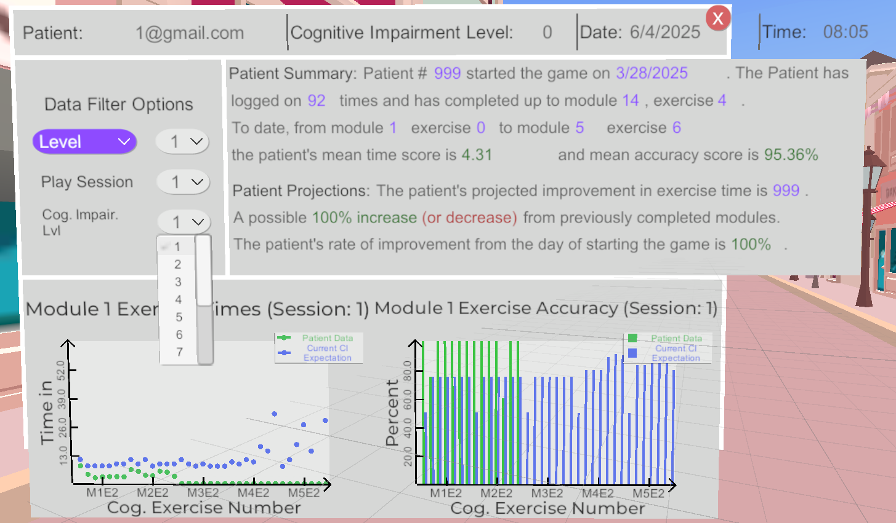

# Known Issues

## Code

- There are lots of numbers and formulas in code that assume each level has 5 modules and each module has 7 exercises
(1 walk to exercise + 6 exercises) when this is not always the case. This has been handled in `GameManager.cs` and `SavePatientData.cs`
but remains an issue in `ScoreManager.cs`, `StatisticsManager.cs`, `DataFilterOptions.cs` and likely more scripts.
- Sometimes Module Name on the floating Menu is incorrect. `Menu.UpdateModuleName()`
- When the GoTo menu is used a 'skipped module' message is triggered on the floating Menu.

## UI

- Statistics menu formatting bug. Some of the text appears to be overflowing the menu.

## Graphics

- Fix Z-fighting present through-out app.
- Sometimes culling appeared to work in the opposite way (near buildings were clipped when looking at them rather than when looking away).
- Mip-maps in downtown level on the road are very noticeable.
    - Might not have anisotropic filtering on.
- Reflections in the downtown area on buildings do not seem to match the environment.
- Lots of textures are blurry, especially noticeable when text is on the texture.

## Features

- Teleport appears to be broken.

