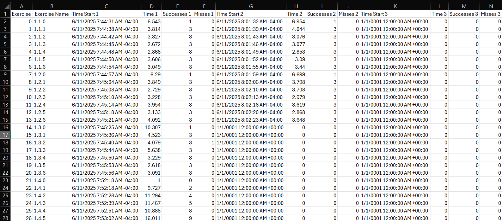

# New Game vs Continue

When a returning patient logs into the application, they will see this menu:

The *Continue* button allows patients to continue from where they left off meaning it loads the patient in at the last module they did not complete in their latest attempt/round. Using this `patient_data.cs` file as an example:

If the patient chooses *Continue*, they skip the *Tutorial* scene and are loaded in at Level 1, Module 3 because the last attempt (attempt 2 here) was completed up to 1.3.0. As the patient continues to play, the data is added to the columns for attempt 2 (`Time Start 2`, `Time 2`, `Successes 2`, and `Misses 2`).

The *New Game* button starts a new attempt/round for the patient. If the patient chooses *New Game*, they start in the *Tutorial* scene and start the game from the beginning. In the `patient_data.cs` file from above, the data would now be stored in the columns for attempt 3 (`Time Start 3`, `Time 3`, `Successes 3`, and `Misses 3`).

