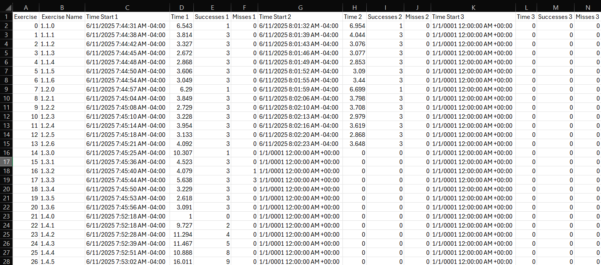

# Patient Data

The player’s performance is saved in a file named `patient_data.csv` using the `SavePatientData.cs` script. The local data is stored at `C:\<your user>\AppData\LocalLow\University of Kentucky\Homebound\patient_data.csv`. Upon starting a new game, every row in the Patient Data file is filled out with placeholder `0` values. Upon completion of an exercise, the player’s performance is saved locally.

Here is an example of the `patient_data.cs` file:

Each row in the file contains these two values:

- **Exercise**: Unique exercise number. Increases starting from 0 to the final exercise.
- **Exercise Name**: Human readable name in the format of `{Level}.{Module}.{Exercise}`.

Then each row also contains 150 groups of these four items:

- **Time Start**: Timestamp the exercise was started. The timestamp represents the current date and time on the machine where the code is executing, with the offset set to the local time zone's offset from UTC.
- **Time**: The total duration taken to complete the exercise in seconds.
    - **Note**: If the patient chooses to *Continue* from the Main Menu ([New Game vs Continue](new_game_vs_continue.md)) or an authorized user uses the "GoTo" menu to jump to a different module, the "WalkTo" exercise will show '1' for 'Time'. See below for what a "WalkTo" exercise is.
- **Successes**: The total number of correct answers picked. Once all correct answers have been selected the user advances to the new exercise or module. This number varies per exercise.
- **Misses**: The total number of incorrect answers picked.

The number next to each `Time Start`, `Time`, `Successes`, and `Misses` column indicate the attempt/game. So `Time Start 1`, `Time 1`, `Success 1` and `Misses 1` all correspond to the first game, `Time 2`, `Success 2` and `Misses 2` to game 2 and so on. At the time of writing, the application allows players to save up to 150 attempts. The first 149 attempts will always be the patients’ first 149 attempts, but every attempt after that is considered attempt 150, meaning, if there is already data written in the columns for attempt 150, it will be overwritten.

Exercises that track the user navigating to a module are also included in the Patient Data (will call them "WalkTo" exercises from here on out). The "WalkTo" exercises fall at the start of modules meaning they are always exercise '0' inside a module (i.e. the exercise name is `{Level}.{Module}.{0}`).

